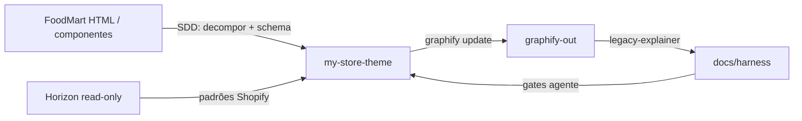

# Shopify Store — FoodMart theme migration

Monorepo para uma loja Shopify com tema customizado **Online Store 2.0**, derivado de um template **HTML estático** (FoodMart) e alinhado a padrões de tema Shopify via referência **Horizon**. O trabalho foi conduzido com **SDD** (Specification-Driven Development), **harness** documental para agentes e um **grafo de código** (Graphify) que descreve o que foi implementado em `my-store-theme/`.

---

## O que partimos e o que entregamos

| Origem | Papel no projeto | Destino em Shopify |
|--------|------------------|-------------------|
| **FoodMart HTML** (`my_docs/frontend-template/FoodMart-1.0.0/`) | Especificação visual e de markup (Bootstrap, Swiper, componentes em `html-components/`) | Sections/snippets Liquid `foodmart-*`, CSS em `src/css/components/foodmart.css` |
| **Tema WordPress / page builders** (mesmo problema de migração) | *Não é o artefato deste repo*, mas o fluxo é análogo: templates PHP/blocos WP → **sections** OS 2.0; `wp_enqueue` → **Vite**; carrinho WooCommerce → objeto **`cart`** Liquid + rotas Shopify | Mesmas camadas descritas abaixo |
| **Horizon** (`my_docs/horizon-read-only/`) | Referência **somente leitura** para comportamento Shopify (schema, Ajax, acessibilidade) | Reimplementação em `my-store-theme/` — sem copiar ficheiros para o deploy |

O tema publicável vive só em **`my-store-theme/`**. Pastas de referência (`my_docs/`, `horizon-read-only` dentro de `my_docs/`) **não** entram na build nem no `theme push`.

---

## SDD — como a especificação guia o código

**SDD** aqui significa: decisões e implementação seguem documentos e contratos explícitos, não “adivinhar” o HTML original nem o tema Horizon.

1. **Especificação de UI (fonte)**  
   - `index.html` e `html-components/` do FoodMart definem secções, classes (`swiper`, `offcanvas`, `product-item`), cores e hierarquia.  
   - Cada bloco virou uma **section** Shopify com `` (nome ≤ 25 caracteres, tipos de block validados no Theme Check).

2. **Especificação de plataforma (Shopify)**  
   - Carrinho, busca, conta e checkout usam `routes.*`, `cart`, `customer`, `linklists` — não formulários estáticos do HTML.  
   - Home montada em `templates/index.json` com ordem fixa de sections (hero, categorias, marcas, trending, carrosséis, newsletter, blog, etc.).

3. **Harness (contrato para humanos e agentes)**  
   - Templates em `docs/harness/*_template.md` descrevem arquitetura, convenções, invariantes de domínio e operações.  
   - A regra `.cursor/rules/harness-docs.mdc` obriga a ler os docs harness (ou templates, até existirem versões “finas”) antes de mudanças estruturais, deploy ou domínio.

4. **Grafo como evidência (Graphify)**  
   - Corpus: apenas `my-store-theme/` (`.graphifyignore` exclui `node_modules/` e bundles gerados).  
   - Saída: `my-store-theme/graphify-out/graph.json` + `GRAPH_REPORT.md` (303 nós · 405 arestas, modo AST).  
   - O grafo confirma, por exemplo, o hub `initTheme()` → `initAlpine`, `initSwiper`, `initIsotope`, etc. (`src/js/theme.js`).

5. **Regras Cursor**  
   - `horizon-reference.mdc`: consultar Horizon antes de features novas; implementar só em `my-store-theme/`.  
   - Skills: `legacy-explainer` (atualizar harness a partir do grafo), `shopify-developer` (Liquid/OS 2.0).

Fluxo resumido:



---

## Decisões arquiteturais principais

| Decisão | Motivo |
|---------|--------|
| **OS 2.0 JSON templates + sections** | Alinha ao modelo Shopify atual; home editável no Theme Editor. |
| **Vite, entrada única** `src/js/theme.js` → `assets/theme.js` + `theme.css` | Mantém npm (Bootstrap, Swiper, Alpine, AOS, Isotope, Typed) sem poluir `assets/` com dezenas de ficheiros manuais. |
| **Bootstrap modular** (Collapse, Dropdown, Modal, Offcanvas) | Header FoodMart com offcanvas para menu, carrinho, busca, conta e favoritos; `window.bootstrap` para compatibilidade. |
| **Swiper** no lugar de Splide | Mesmas classes do HTML de referência (`main-swiper`, `products-carousel`, …). |
| **Prefixo `foodmart-`** em sections/snippets | Evita colisão com sections genéricas; facilita grep e grafo. |
| **Horizon só em `my_docs/`** | Gap de funcionalidade Shopify sem symlink/cópia para o tema deployável. |
| **Grafo restrito ao tema** | Documentação e agentes não misturam template HTML nem Horizon com o código deployado. |

Detalhe completo: `docs/harness/architeture_rules_template.md` e `docs/harness/domain_invariants_template.md`.

---

## Estrutura do repositório

```
shopify-store/
├── README.md                 # este ficheiro
├── package.json              # scripts Shopify CLI na raiz (--path my-store-theme)
├── docs/harness/             # templates harness (gerados/atualizados via Graphify)
├── my_docs/
│   ├── frontend-template/FoodMart-1.0.0/   # spec HTML (referência)
│   └── horizon-read-only/                  # spec Shopify Horizon (referência)
├── my-store-theme/           # tema Shopify (deploy)
│   ├── layout/theme.liquid
│   ├── sections/             # header, foodmart-*, fm-product-carousel, …
│   ├── snippets/             # foodmart-offcanvas-*, foodmart-product-item, …
│   ├── templates/index.json
│   ├── src/                  # CSS/JS fonte (Vite)
│   ├── assets/               # theme.js/css compilados + imagens foodmart
│   ├── config/
│   └── graphify-out/         # grafo local (não fazer push para a loja)
└── tests/                    # Vitest (repo root)
```

---

## Mapeamento HTML → Shopify (exemplos)

| FoodMart (`html-components/`) | Implementação |
|-------------------------------|---------------|
| `partials/header.html` + offcanvas search/cart | `sections/header.liquid` + `snippets/foodmart-offcanvas-*.liquid` |
| `hero-section-pattern.html` | `sections/foodmart-hero-banners.liquid` |
| `partials/category-slider.html` | `sections/foodmart-category-carousel.liquid` |
| `partials/product-item.html` | `snippets/foodmart-product-item.liquid` |
| `home-gallery-with-filters.html` | `sections/foodmart-trending-products.liquid` + `initIsotope()` |
| Carrosséis Swiper | `sections/fm-product-carousel.liquid` + `src/js/modules/swiper.js` |

WordPress (quando aplicável ao mesmo projeto): o equivalente seria mover **template parts** / blocos para **sections**, hooks para **snippets**, e assets do tema filho para **`src/` + Vite**, mantendo o mesmo harness e grafo só na pasta do tema Shopify.

---

## Desenvolvimento

Requisitos: **Node ≥ 22**, Shopify CLI, acesso à loja configurado localmente.

```bash
# Instalar dependências do tema
cd my-store-theme && npm install

# Compilar assets (obrigatório após mudar src/)
npm run build

# Na raiz do monorepo: preview + upload
npm run theme:dev    # desenvolvimento
npm run theme:check  # Theme Check
npm run theme:push   # deploy (ajustar --store no script ou CLI)
```

Testes no monorepo: `npm test` (Vitest).

### Atualizar o grafo e o harness

```bash
cd my-store-theme
graphify update . --no-cluster
graphify cluster-only . --no-label --no-viz
# Depois: skill legacy-explainer ou revisão manual de docs/harness/*_template.md
```

Com `GEMINI_API_KEY` ou `GOOGLE_API_KEY`, `graphify .` permite extração semântica mais rica.

---

## Harness — ficheiros e gates

| Template | Conteúdo |
|----------|----------|
| `architeture_rules_template.md` | Camadas, fluxos, integrações, decisões |
| `coding_conventions_template.md` | Layout repo, naming, tooling |
| `domain_invariants_template.md` | Regras de negócio do storefront (cart, search, schema, carrosséis) |
| `operational_constraints_template.md` | Build, deploy, Graphify, `.env` |

Promover templates a docs “vivos” (opcional): copiar para `architecture_rules.md`, `coding_convention.md`, etc., conforme `harness-docs.mdc`.

---

## Referências rápidas

- Grafo: `my-store-theme/graphify-out/GRAPH_REPORT.md`
- Entrada JS: `my-store-theme/src/js/theme.js`
- Home: `my-store-theme/templates/index.json`
- Regra Horizon: `.cursor/rules/horizon-reference.mdc`
- Demo FoodMart: [templatesjungle FoodMart](https://demo.templatesjungle.com/foodmart/)

---

## Estado atual e próximos passos

- Home FoodMart implementada com conteúdo demo (`demo_image` nos settings).  
- Header com busca funcional no desktop e offcanvas em todas as larguras para menu, carrinho e área do cliente.  
- Footer genérico: pode ser alinhado ao `html-components/partials/footer.html` no mesmo processo SDD.  
- Imagens e copy finais: substituir no Theme Editor / assets da loja.

Para qualquer alteração grande, ler o harness correspondente e, se o código mudou muito, regenerar `graphify-out/` antes de atualizar `docs/harness/`.
